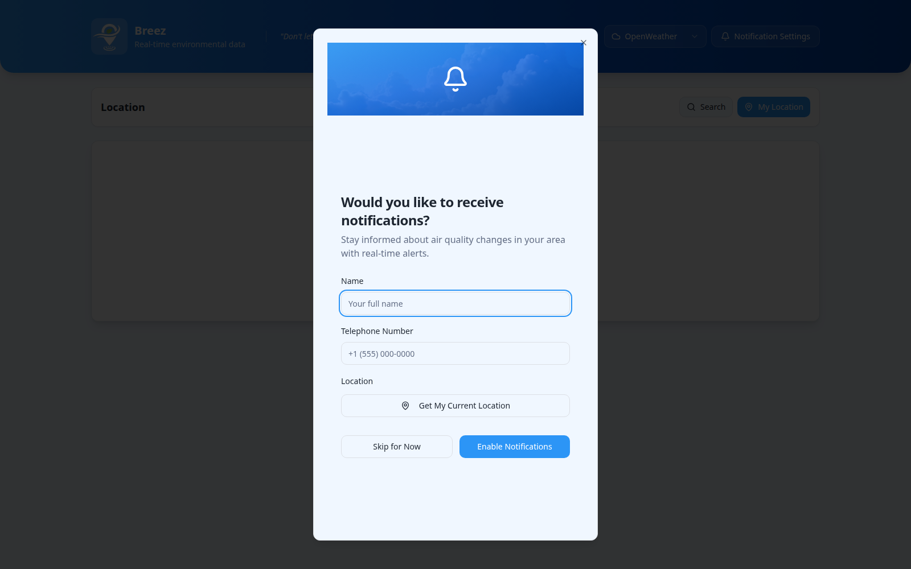
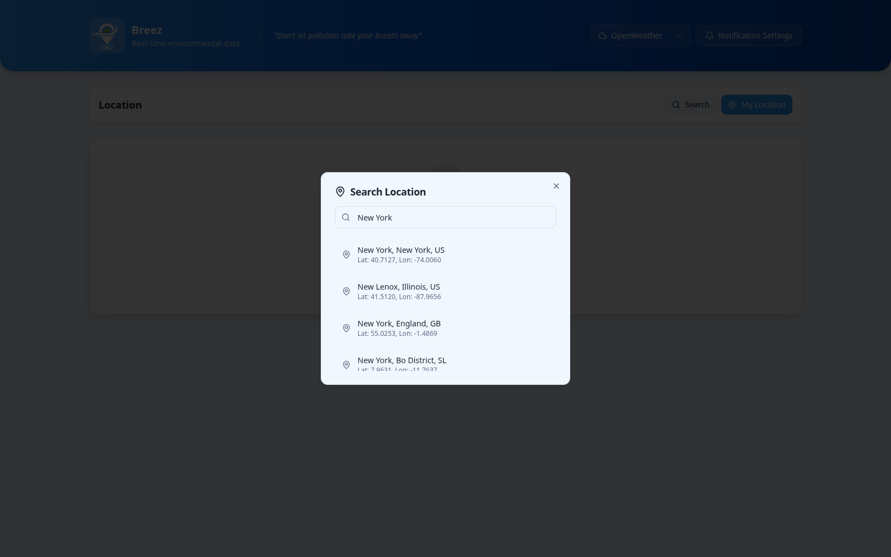
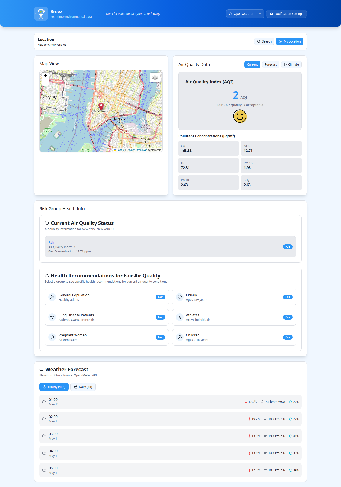
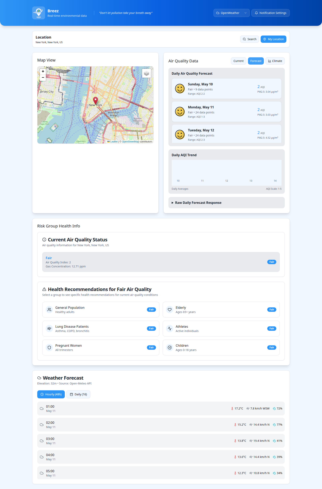
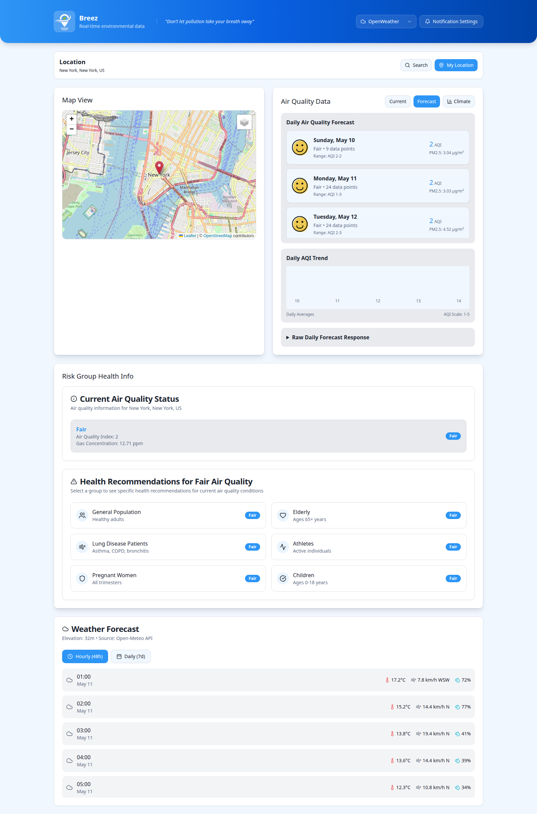
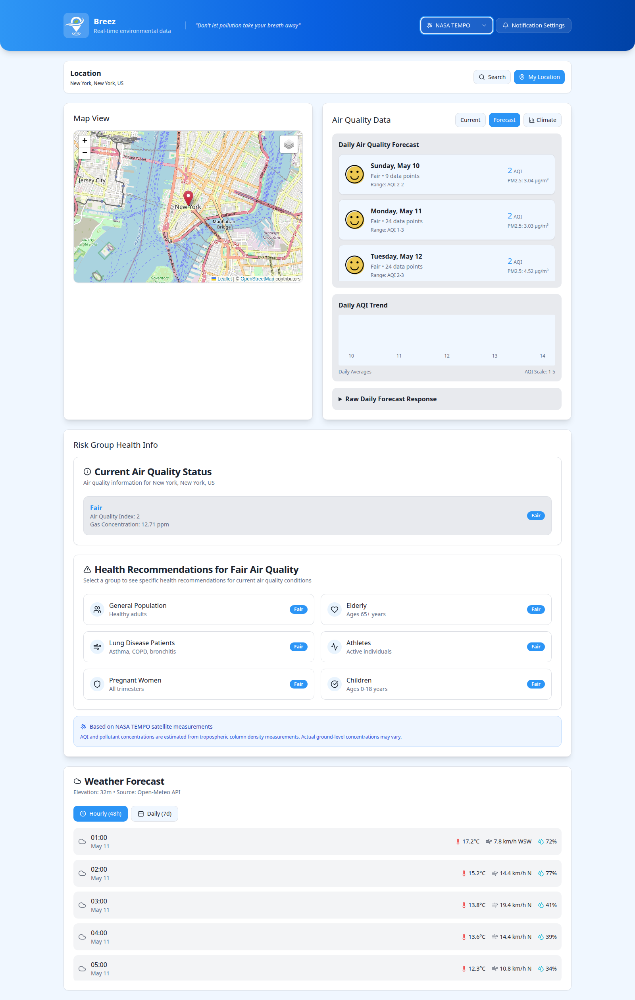
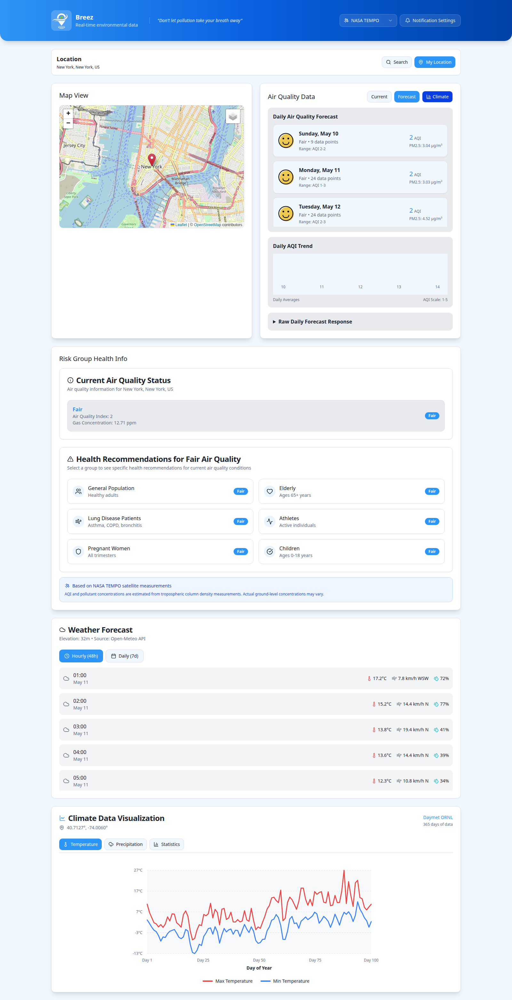

# Breez - Air Quality and Climate Intelligence

Breez is a NASA Space Apps 2025 project focused on helping people understand local air quality risk using real-time and satellite-backed environmental data.

The application combines:
- OpenWeather air pollution data for global coverage
- NASA TEMPO satellite measurements for US-focused atmospheric insights
- Daymet historical climate data for contextual trend visualization
- Risk-group-oriented health guidance

## Main Purpose

Breez gives users a practical, location-based environmental briefing so they can:
- See current AQI and pollutant concentrations
- Compare forecasted air quality trends
- Switch between global API data and satellite-derived data
- Understand health impact guidance by risk group
- View weather and climate context for the selected location

## Architecture

- Frontend: React + Vite (`frontend`)
- Backend API: FastAPI (`backend`)
- Optional service: WhatsApp notification microservice (`qualidade-do-ar`)

The main user flow documented below is based on `frontend + backend`.

## Local Setup

### 1. Backend

```bash
cd backend
source venv/bin/activate
python main.py
```

Expected: API running at `http://localhost:8000`.

Required environment values are read from `backend/.env`, including:
- `OPENWEATHER_API_KEY_1` (or `OPENWEATHER_API_KEYS`)
- `EARTHDATA_USERNAME` and `EARTHDATA_PASSWORD` (for TEMPO endpoints)

### 2. Frontend

```bash
cd frontend
npm install
npm run dev -- --host 127.0.0.1 --port 5173
```

Frontend env expected in `.env` (repo root currently contains these keys):
- `VITE_API_URL_PRIMARY`
- `VITE_API_URL_FALLBACK`

### 3. Health Data Asset

The health recommendation CSV is required by the `HealthInfoTab` component and is included at:
- `frontend/public/data/crisis_group.csv`

## Main Application Flow (Screenshots)

### 1) First-visit notification onboarding



Users can opt in to notifications by providing name, phone number, and current location.

### 2) Location search and selection



Users search by city/address and select a location to load all environmental widgets.

### 3) Current air quality (OpenWeather mode)



The main dashboard shows map context, AQI score, and pollutant concentration cards.

### 4) Daily air quality forecast



Users can switch to forecast mode to inspect daily AQI evolution and trend bars.

### 5) Risk-group health guidance


Recommendations are tailored by audience segment (children, elderly, athletes, etc.) based on AQI conditions.

### 6) Weather forecast context



Hourly and daily weather forecasts provide context for air quality interpretation.

### 7) NASA TEMPO satellite mode



Switching data source to TEMPO surfaces satellite-derived pollutant estimates and metadata.

### 8) Daymet climate visualization



Climate charts add historical context (temperature and precipitation) for the selected location.

## Notes and Limitations

- TEMPO coverage is US-focused; non-US locations may not return satellite measurements.
- TEMPO data has practical latency and may use historical fallback windows.
- The WhatsApp service in `qualidade-do-ar` is optional and not required for the core UI flow shown above.
